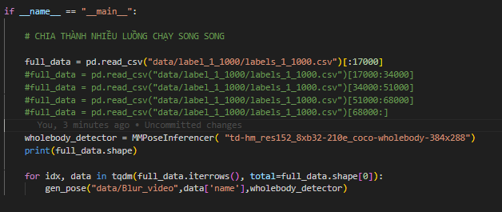

**Set up thí nghiệm**

1. Clone github [https://github.com/Etdihatthoc/VN\_SIGN](https://github.com/Etdihatthoc/VN\_SIGN)   
1. Tải dataset Blur\_video từ Drive [https://drive.google.com/drive/folders/11CDJZo111eC36E6FalRkBBw76LI9oa1p](https://drive.google.com/drive/folders/11CDJZo111eC36E6FalRkBBw76LI9oa1p) lưu vào folder data: data/Blur\_video  
1. Tạo môi trường ảo, install các package trong requirements.txt :   
   pip install \-r requirements.txt  
1. Tại tmux, active môi trường, setup bằng lệnh:  
   export LD\_LIBRARY\_PATH=$(echo $LD\_LIBRARY\_PATH | tr ':' '\\n' | grep \-vE '/usr/local/cuda-11.0/lib64|/usr/local/cuda/extras/CUPTI/lib64' | tr '\\n' ':')  
   export PATH="/usr/local/cuda-11.4/bin:$PATH"   
   export LD\_LIBRARY\_PATH="/usr/local/cuda-11.4/lib64:$LD\_LIBRARY\_PATH"  
   

**Chú ý:**

- Điều chỉnh batch\_size, device, .. tại phần configs của các model tương ứng  
  ví dụ: với ID3 : configs/i3d/label\_1\_1000/i3d\_one\_view\_from\_scratch.yaml

**Train model from scratch**  
1\. ID3 one view

1. Train: 

   python main.py \--config configs/i3d/label\_1\_1000/i3d\_one\_view\_from\_scratch.yaml

1. Test 

   python main.py \--config configs/i3d/test\_cfg/label\_1\_1000/i3d\_one\_view\_from\_scratch.yaml

2\. MVIT\_v2 one view

1. Train:

   python main.py \--config configs/mvit\_v2/label\_1\_1000/mvit\_v2\_S\_one\_view\_1\_1000\_finetune\_from\_scratch.yaml

1. Test:

   python main.py \--config

   configs/mvit\_v2/test\_cfg/label\_1\_1000/mvit\_v2\_S\_one\_view\_finetune\_from\_scratch.yaml

   

3\. Swin Transformer one view

1. Train: 

   python main.py \--config configs/swin\_transformer\_3d/label\_1\_1000/swin\_transformer\_3d\_T\_one\_view\_from\_scratch.yaml

1. Test 

   python main.py \--config configs/swin\_transformer\_3d/test\_cfg/label\_1\_1000/swin\_transformer\_3d\_T\_one\_view\_from\_scratch.yaml

   

4\. ID3 three view

1. Train: 

   python main.py \--config configs/i3d/label\_1\_1000/i3d\_three\_view\_finetune\_from\_one\_view.yaml

1. Test 

   python main.py \--config configs/i3d/test\_cfg/label\_1\_1000/i3d\_three\_view\_finetune\_from\_one\_view.yaml

   

5\. MVIT\_v2 three view

1. Train:

   python main.py \--config configs/mvit\_v2/label\_1\_1000/mvit\_v2\_S\_three\_view\_1\_1000\_finetune\_from\_one\_view.yaml

1. Test:

   python main.py \--config

   configs/mvit\_v2/test\_cfg/label\_1\_1000/mvit\_v2\_S\_three\_view\_finetune\_from\_one\_view.yaml

   

6\. Swin Transformer three view

1. Train: 

   python main.py \--config configs/swin\_transformer\_3d/label\_1\_1000/swin\_transformer\_3d\_T\_three\_view\_finetune\_from\_one\_view.yaml

1. Test 

   python main.py \--config configs/swin\_transformer\_3d/test\_cfg/label\_1\_1000/swin\_transformer\_3d\_T\_three\_view\_finetune\_from\_one\_view.yaml

   
NOTE\. Gen poseflow for VTN

1. Tạo nhiều tmux và chạy song song các range, chú ý chỉnh range trong main() của tools/gen_wholebody.py và tools/gen_pose_v2.py như trong hình
2. Chạy tools/gen_wholebody.py =>> CUDA_VISIBLE_DEVICES=1 python tools/gen_wholebody.py
3. Chạy tools/gen_pose_v2.py =>> CUDA_VISIBLE_DEVICES=1 python tools/gen_pose_v2.py
4. Chạy tools/extract_poseflow.py =>> CUDA_VISIBLE_DEVICES=1 python tools/extract_poseflow.py
5. Xóa folder data/wholebody_1_1000
   